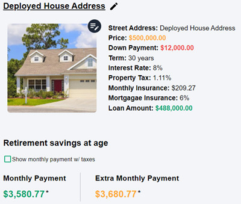
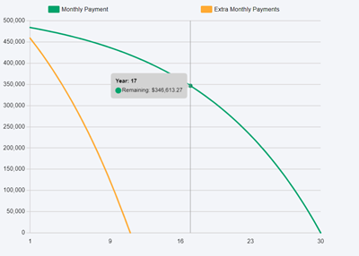
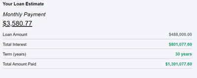
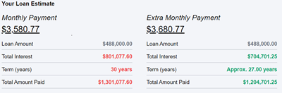

# The Finance Calculator
- [The Finance Calculator](https://thefinancecalculator.org/)

# Description
This application is a calculator that uses future value, present value, cost of debt, and other equations to find how much something cost. You will be able to visually see how time and interest play a crucial part on the type of loans you choose and the type of investments you decide.

# Why
When I was in high school a friend recommended that I read Rich Dad Poor Dad, that book ended up compelling me to learn more about money and finance. As I started learning more and more about money, I started seeing a recurring problem. Whether it be social media, coworkers, and even my friends. A lot of people didn't fully understand the power of interest rates and time. I’ve had friends, family, and coworkers take out loans and or incur debt but do not know how their interest rate and term will cost them in the long run. 

I built this application so people can have a place where they can visually see the relationship between interest and time. They will be able to determine if that car loan and or mortgage is worth it, because they will be able to run the numbers. And ultimately also have the chance to see how much that loan will cost them over that period of time, and hopefully make a better informed decision. 
 


## Preview

- How a goal will look .. You will have multiple options on the type of goal you would like to make



- There will be a chart showing how much money will be paid over the course of the loan



- A summary section just explaining more about the loan



- If theres an extra monthly payment, the summary section will show how that will impact your loan and how much you pay.




## Installation

#### Env Files

- Client (Frontend)
.env
```bash
  REACT_APP_LOCALHOST_API=<Your backend api>
```
example: REACT_APP_LOCALHOST_API="http://localhost:4000"

-----


- Sever (backend)
.env.docker

MAIL_PASSWORD: [Google App Password](https://lizenshakya.medium.com/how-to-send-mails-with-gmail-using-nodemailer-after-less-secure-app-is-disabled-by-google-b41abf3fdada)
```bash
MAIL_PASSWORD=<Using nodemailer, also using google email. You will need to get your apps password>
EMAIL=<Your email>
POSTGRES_URI_COST_OF_LIVING=postgresql://<USER>@<HOST>:5432/costOfLivingIndex
POSTGRES_URI_AUTH=postgresql://<USER>@<HOST>:5432/dataScrape
TYPE=dev
SECRET=<Secret for JSON Web Token>
BUISNESS_EMAIL=<Your email>
BUISNESS_PASSWORD=<Using nodemailer, also using google email. You will need to get your apps password>
AWS_SECRET_KEY=<AWS SECRET KEY>
AWS_ACCESS_KEY=<AWS ACCESS KEY>
BUCKET=<Create a bucket with aws s3>
REGION=<Enter Bucker Region>
CONTENT_CREATOR_BUCKET=<Create a bucket with aws s3>
POSTGRES_HOST_AUTH_METHOD= "trust"
POSTGRES_HOST= <Postgres Host>
POSTGRES_USER= <Postgres User>
POSTGRES_DB= dataScrape
```


#### Docker
- Once all enviroment variables are set

```bash
  docker compose up --build
```