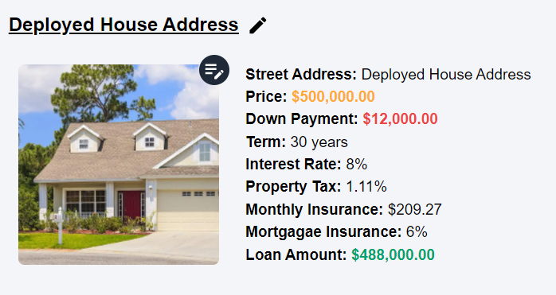
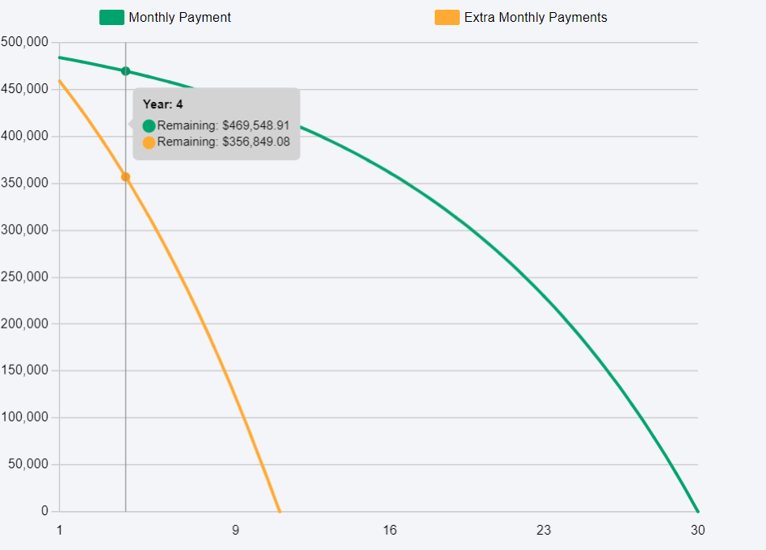
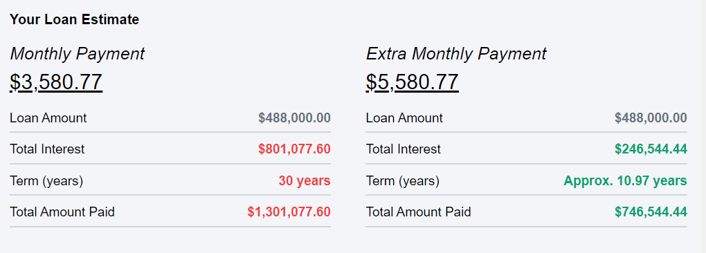

# The Finance Calculator
- [The Finance Calculator](https://thefinancecalculator.org/)

# Description
This application is a calculator that uses future value, present value, cost of debt, and other equations to find how much something cost. You will be able to visually see how time and interest play a crucial part on the type of loans you choose and the type of investments you decide.

# Why
When I was in high school a friend recommended that I read Rich Dad Poor Dad, that book ended up compelling me to learn more about money and finance. As I started learning more and more about money, I started seeing a recurring problem. Whether it be social media, coworkers, and even my friends. A lot of people didn't fully understand the power of interest rates and time. I’ve had friends, family, and coworkers take out loans and or incur debt but do not know how their interest rate and term will cost them in the long run. 

I built this application so people can have a place where they can visually see the relationship between interest and time. They will be able to determine if that car loan and or mortgage is worth it, because they will be able to run the numbers. And ultimately also have the chance to see how much that loan will cost them over that period of time, and hopefully make a better informed decision. 
 


## Preview

- How a goal will look .. You will have multiple options on the type of goal you would like to make



- There will be a chart showing how much money will be paid over the course of the loan




- If theres an extra monthly payment, the summary section will show how that will impact your loan and how much you pay.



## Features

- Light/dark mode toggle
- Docker
- Redux Persist
- Puppeteer data scrape (Scraped all the cars from carvana)
- AWS S3 Bucket, images are saved in aws bucket then the URL is saved to database
- Login, Sign Up, Forget Passoword Auth

## Tech Stack

**Client:** React, Redux, TailwindCSS, Docker

**Server:** Node, Express, PostgreSQL, Docker, AWS S3


## Installation

### Environment Variables

To run this project, you will need to add the following environment variables to your .env file

### Client (React)
.env

`REACT_APP_LOCALHOST_API` : Connect to your backend localhost

### Server (NodeJS)
.env.docker


#### Environment Variable Descriptions
|ENV| DESC  |
|---|---|
|  `MAIL_PASSWORD` |  Using nodemailer, also using google email. You will need to get your apps password. [Google App Password](https://lizenshakya.medium.com/how-to-send-mails-with-gmail-using-nodemailer-after-less-secure-app-is-disabled-by-google-b41abf3fdada) |
| `EMAIL`  | Your Email  |
| `POSTGRES_URI_COST_OF_LIVING`  |  postgresql://<USER>@<HOST>:5432/costOfLivingIndex  |
| `POSTGRES_URI_AUTH`  |  postgresql://<USER>@<HOST>:5432/dataScrape |
|  `TYPE` | Docker  |
| `SECRET`  |  Secret for JSON Web Token |
| `BUISNESS_EMAIL`  |  Your Email |
|  `BUISNESS_PASSWORD` | Using nodemailer, also using google email. You will need to get your apps password. [Google App Password](https://lizenshakya.medium.com/how-to-send-mails-with-gmail-using-nodemailer-after-less-secure-app-is-disabled-by-google-b41abf3fdada) |
|  `AWS_SECRET_KEY` | AWS SECRET KEY  |
| `AWS_ACCESS_KEY`  | AWS ACCESS KEY  |
| `BUCKET`  | Create a bucket with aws s3 to store images from goals |
| `CONTENT_CREATOR_BUCKET`  |  Create a bucket with aws s3 to store images for content creators |
|  `POSTGRES_HOST_AUTH_METHOD` | 'Trust' |
| `POSTGRES_HOST`  | Enter Your Postgres Host |
| `POSTGRES_USER`  | Enter Your Postgres User |
|  `POSTGRES_DB` | dataScrape |


#### Docker
- Once all enviroment variables are set

```bash
  docker compose up --build
```

## Running Tests

To run tests, run the following command ... Client

```bash
  npm run test
```